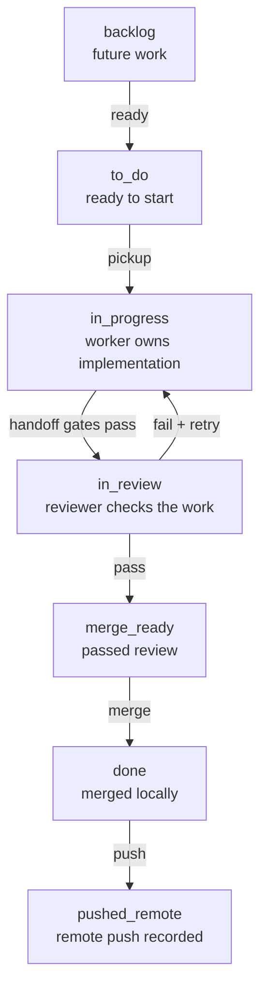
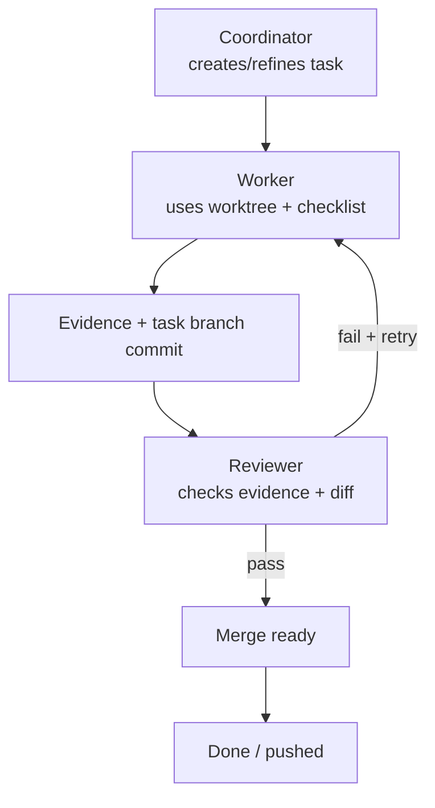

# UTLT Agent Onboarding

This is the 80/20 guide for early-access operators trying `agent@3-alpha` in a
test project. Use a repository or project folder you are comfortable letting
agent workers modify.

Run project commands from the project root unless a step says otherwise.

For the detailed workflow, lane policy, project state layout, and full
worker/reviewer handoff graph, see [onboarding-full.md](onboarding-full.md).

## Index

- [Summary](#summary)
- [Setup Journey](#setup-journey)
  - [Step 1. Install The `utlt` Launcher](#step-1-install-the-utlt-launcher)
  - [Step 2. Install The `agent@3-alpha` Package](#step-2-install-the-agent3-alpha-package)
  - [Step 3. Initialize Agent State Inside Your Project](#step-3-initialize-agent-state-inside-your-project)
  - [Step 4. Launch The Coordinator](#step-4-launch-the-coordinator)
  - [Step 5. Add Task Observability](#step-5-add-task-observability)
  - [Step 6. Add Agent Observability](#step-6-add-agent-observability)
- [Actions](#actions)
  - [Use The Coordinator To Capture Work](#use-the-coordinator-to-capture-work)
  - [Inspect Work Before Merge](#inspect-work-before-merge)
  - [Stop All Agent Sessions](#stop-all-agent-sessions)
- [Quick Lane Path](#quick-lane-path)
- [Quick Worker/Reviewer Loop](#quick-workerreviewer-loop)
- [Full Guide](#full-guide)

## Summary

Use `agent@3-alpha` when a request should become durable, observable work:
tasks, worker sessions, reviewer sessions, task worktrees, evidence, review,
and merge state. For one-off questions, normal Codex is usually simpler.

The practical loop is:

1. Install `utlt`, the Arendi app launcher and package manager.
2. Install the `agent@3-alpha` package.
3. Initialize agent state inside a project folder.
4. Launch the coordinator.
5. Optionally watch tasks and live agents in separate terminals.
6. Use the coordinator to capture tasks and route work.
7. Inspect reviewed work before merge.

## Setup Journey

`utlt` and `agent@3-alpha` are separate pieces. You need both.

- `utlt` is not the agent. It is the Arendi app launcher and package manager.
- `agent@3-alpha` is not the launcher. It is the agent package installed by
  `utlt`.
- Homebrew is the install channel for `utlt` on macOS and Linux; it is not the
  product you use day to day.
- After both are installed, commands like `utlt agent init` use the
  `agent@3-alpha` package through the `utlt` launcher.

### Step 1. Install The `utlt` Launcher

If this machine does not have `utlt` yet, start with the
[root README install guide](../../README.md#install). That guide walks through
the Homebrew-based install path for getting `utlt` onto this machine.

If this machine already has `utlt`, update the launcher:

```bash
utlt update utlt
```

Next: install the
[`agent@3-alpha` package below on this page](#step-2-install-the-agent3-alpha-package).

### Step 2. Install The `agent@3-alpha` Package

Install the agent package:

```bash
utlt install agent@3-alpha --install-dependencies
```

`agent@3-alpha` is the package that adds agent orchestration: the coordinator,
task board, worker sessions, reviewer sessions, evidence, and merge tracking.

If you already installed `agent@3-alpha` earlier and only want to refresh it,
use:

```bash
utlt update agent@3-alpha --install-dependencies
```

Next: initialize
[agent state inside your project below on this page](#step-3-initialize-agent-state-inside-your-project).

### Step 3. Initialize Agent State Inside Your Project

Move into a test project:

```bash
cd /path/to/test-project
```

Initialize `agent@3-alpha` for this project:

```bash
utlt agent init
```

This is required before the [coordinator](#step-4-launch-the-coordinator),
[task board](#step-5-add-task-observability), workers, and reviewers can
operate in a project. It creates project-local state under `.arendi/corev3`:

```text
.arendi/corev3/
  lanes.toml
  settings.toml
  tasks/
  events/
  agents/
  sessions/
  worktrees/
  daemon/
  observe/
```

The important part is
[`worktrees/`](onboarding-full.md#worktrees). Each task gets its own Git
worktree there, so you can inspect the actual files a worker changed before
anything is merged.

Next: launch [the coordinator below on this page](#step-4-launch-the-coordinator).

### Step 4. Launch The Coordinator

```bash
utlt agent codex
```

The coordinator is required. It is the main UX for the agent package. Talk to
it like a normal Codex session, but use it to create/refine tasks, route worker
sessions, answer status questions, and merge reviewed work.

By default, automation can run up to five worker tasks in `in_progress` and five
reviewer tasks in `in_review` at the same time. Each task that reaches review
gets a reviewer session.

Next: optionally add [task observability below on this page](#step-5-add-task-observability).

### Step 5. Add Task Observability

```bash
utlt agent observe tasks
```

This is optional, but recommended. Open it in a second terminal window or tab.
It shows lanes, task details, checklists, evidence, review status, and merge
readiness.

Next: optionally add [agent observability below on this page](#step-6-add-agent-observability).

### Step 6. Add Agent Observability

```bash
utlt agent observe agents
```

This is optional. Open it in a third terminal window or tab. It shows worker and
reviewer panes while they run. Do not type into those panes; ask the
[coordinator](#step-4-launch-the-coordinator) to manage workers and reviewers.

Next: use the [Actions below on this page](#actions) to capture work and inspect
results before merge.

## Actions

### Use The Coordinator To Capture Work

Use the [coordinator](#step-4-launch-the-coordinator) to turn messy intent into
durable task state. You can paste notes, action items, bug reports, or a rough
goal. The coordinator parses the request, asks for clarification when needed,
and records tasks with titles, descriptions, acceptance criteria, checklists,
lane state, claims, evidence, review state, and merge state.

Good coordinator prompts:

```text
Capture these action items as reviewed tasks and start the first one.
```

```text
Create tasks for the onboarding copy cleanup, keep the docs user-facing, and
route each task through review.
```

```text
Show me what is in progress, what is blocked, and what is ready to merge.
```

### Inspect Work Before Merge

Before merging, inspect the task worktree. The easiest path is usually Finder
or your Linux file manager:

#### Finder Or File Manager

```bash
open .arendi/corev3/worktrees
```

```bash
xdg-open .arendi/corev3/worktrees
```

If `.arendi` is hidden, show hidden files first. In macOS Finder, press
`Shift + Cmd + .`. In most Linux file managers, press `Ctrl + H`.

Open the task folder, such as `t-0001`, review the files the worker changed,
and run the project checks from that task worktree before merge.

#### Terminal Path

```bash
ls .arendi/corev3/worktrees
```

```bash
cd .arendi/corev3/worktrees/t-0001
```

```bash
git status --short
```

Replace `t-0001` with the task worktree you want to QA. The
[task board](#step-5-add-task-observability) shows which task is ready for
review or merge. Merge only after the task has evidence, a reviewer pass, and
worktree checks that match the project.

### Stop All Agent Sessions

Use this as the agent-session kill switch when you want to close all running
agent sessions for the project:

```bash
utlt agent stop all
```

## Quick Lane Path

This is the outer task-board workflow. You see these lanes in
`utlt agent observe tasks`; they describe where one task is in the delivery
process.



## Quick Worker/Reviewer Loop

This is the inner loop for a task after it reaches implementation. The
coordinator routes work, the worker changes the task worktree, and the reviewer
checks the evidence and committed diff before merge.



See [Worker And Reviewer Cycle](onboarding-full.md#worker-and-reviewer-cycle)
for the complete handoff graph.

## Full Guide

Use [onboarding-full.md](onboarding-full.md) when you need:

- the full install and update walkthrough
- the `.arendi/corev3` folder structure
- lane meanings and default lane behavior
- `lanes.toml` policy sections
- the full worker/reviewer handoff graph
- worktree, merge, and troubleshooting details
