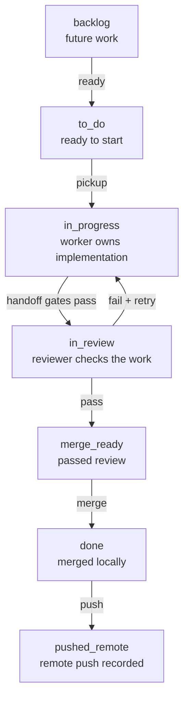
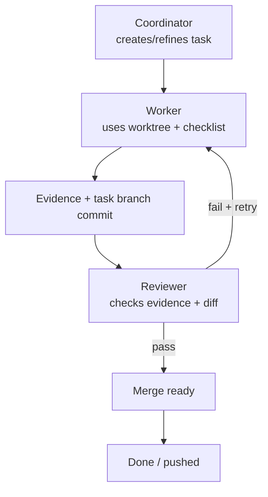

# UTLT Agent Onboarding

This is the 80/20 guide for early-access operators trying `agent@3-alpha` in a
test project. Use a repository or project folder you are comfortable letting
agent workers modify.

Run project commands from the project root unless a step says otherwise.

For the detailed workflow, lane policy, project state layout, and full
worker/reviewer handoff graph, see [onboarding-full.md](onboarding-full.md).

## Index

- [Summary](#summary)
- [Quick Start](#quick-start)
  - [Fresh Install](#fresh-install)
  - [Existing Install](#existing-install)
  - [Project Setup](#project-setup)
  - [Terminal 1: Coordinator](#terminal-1-coordinator)
  - [Terminal 2: Task Board](#terminal-2-task-board)
  - [Terminal 3: Live Agents](#terminal-3-live-agents)
  - [QA Before Merge](#qa-before-merge)
  - [Stop All Agent Sessions](#stop-all-agent-sessions)
- [Quick Lane Path](#quick-lane-path)
- [Quick Worker/Reviewer Loop](#quick-workerreviewer-loop)
- [Full Guide](#full-guide)

## Summary

Use `agent@3-alpha` when a request should become durable, observable work:
tasks, worker sessions, reviewer sessions, task worktrees, evidence, review,
and merge state. For one-off questions, normal Codex is usually simpler.

The practical loop is:

1. Start from a test project.
2. Initialize ACV3 state.
3. Open the coordinator.
4. Watch tasks and live agents in separate terminals.
5. Let workers edit task worktrees.
6. Let reviewers inspect evidence and committed diffs.
7. Merge only reviewed work.

## Quick Start

`utlt` and `agent@3-alpha` are separate pieces. You need both.

- `utlt` is not the agent. It is the launcher and package manager installed by
  Homebrew.
- `agent@3-alpha` is not the launcher. It is the agent package installed by
  `utlt`.
- After both are installed, commands like `utlt agent init` use the
  `agent@3-alpha` package through the `utlt` launcher.

### Fresh Install

If this machine does not have `utlt` yet, follow the
[root README install guide](../../README.md#install). That guide installs the
`utlt` launcher first, then uses `utlt` to install `agent@3-alpha`.

After that fresh install, come back here and continue with
[Project Setup below on this page](#project-setup). You do not need the update
commands in the next section.

### Existing Install

If this machine already has `utlt`, refresh the launcher first:

```bash
utlt update utlt
```

Then refresh and activate the agent package:

```bash
utlt update agent@3-alpha --install-dependencies
```

### Project Setup

Move into a test project:

```bash
cd /path/to/test-project
```

Initialize ACV3 state for this project:

```bash
utlt agent init
```

This is required before the [coordinator](#terminal-1-coordinator),
[task board](#terminal-2-task-board), workers, and reviewers can operate in a
project. It creates project-local state under `.arendi/corev3`:

```text
.arendi/corev3/
  lanes.toml
  settings.toml
  tasks/
  events/
  agents/
  sessions/
  worktrees/
  daemon/
  observe/
```

The important part is
[`worktrees/`](onboarding-full.md#worktrees). Each task gets its own Git
worktree there, so you can inspect the actual files a worker changed before
anything is merged.

Next: open [Terminal 1: Coordinator below on this page](#terminal-1-coordinator).

### Terminal 1: Coordinator

```bash
utlt agent codex
```

Use the coordinator as the main UX. Ask it to create/refine tasks, route work,
answer status questions, and merge reviewed work. By default, automation can run
up to five worker tasks in `in_progress` and five reviewer tasks in `in_review`
at the same time. Each task that reaches review gets a reviewer session.

Next: open [Terminal 2: Task Board below on this page](#terminal-2-task-board)
in a separate terminal window or tab.

### Terminal 2: Task Board

```bash
utlt agent observe tasks
```

Open this in a separate terminal window or tab. It shows lanes, task details,
checklists, evidence, review status, and merge readiness.

Next: open [Terminal 3: Live Agents below on this page](#terminal-3-live-agents)
in another terminal window or tab.

### Terminal 3: Live Agents

```bash
utlt agent observe agents
```

Open this in another terminal window or tab. It shows worker and reviewer panes
while they run. Do not type into those panes; ask the coordinator to manage
workers and reviewers.

Next: use [QA Before Merge below on this page](#qa-before-merge) before asking
the coordinator to merge reviewed work.

### QA Before Merge

Before merging, inspect the task worktree. The easiest path is usually Finder
or your Linux file manager:

#### Finder Or File Manager

```bash
open .arendi/corev3/worktrees
```

```bash
xdg-open .arendi/corev3/worktrees
```

If `.arendi` is hidden, show hidden files first. In macOS Finder, press
`Shift + Cmd + .`. In most Linux file managers, press `Ctrl + H`.

Open the task folder, such as `t-0001`, review the files the worker changed,
and run the project checks from that task worktree before merge.

#### Terminal Path

```bash
ls .arendi/corev3/worktrees
```

```bash
cd .arendi/corev3/worktrees/t-0001
```

```bash
git status --short
```

Replace `t-0001` with the task worktree you want to QA. The
[Task Board section above on this page](#terminal-2-task-board) shows which task
is ready for review or merge. Merge only after the task has evidence, a reviewer
pass, and worktree checks that match the project.

### Stop All Agent Sessions

Use this as the ACV3 kill switch when you want to close all running agent
sessions for the project:

```bash
utlt agent stop all
```

## Quick Lane Path

This is the outer task-board workflow. You see these lanes in
`utlt agent observe tasks`; they describe where one task is in the delivery
process.



## Quick Worker/Reviewer Loop

This is the inner loop for a task after it reaches implementation. The
coordinator routes work, the worker changes the task worktree, and the reviewer
checks the evidence and committed diff before merge.



See [Worker And Reviewer Cycle](onboarding-full.md#worker-and-reviewer-cycle)
for the complete handoff graph.

## Full Guide

Use [onboarding-full.md](onboarding-full.md) when you need:

- the full install and update walkthrough
- the `.arendi/corev3` folder structure
- lane meanings and default lane behavior
- `lanes.toml` policy sections
- the full worker/reviewer handoff graph
- worktree, merge, and troubleshooting details
