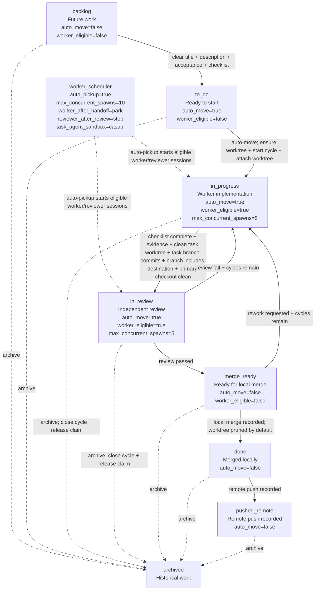
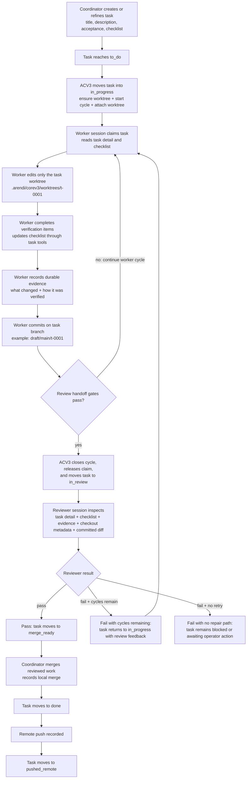

# UTLT Agent Onboarding

This guide is for early-access operators trying `agent@3-alpha` in a test
project. Use a repository or project folder you are comfortable letting agent
workers modify.

Run project commands from the project root unless a step says otherwise.

## Index

- [What ACV3 Orchestration Does](#what-acv3-orchestration-does)
- [Workflow At A Glance](#workflow-at-a-glance)
- [Install](#install)
- [Update](#update)
- [Start A Test Project](#start-a-test-project)
- [Project State Under `.arendi/corev3`](#project-state-under-arendicorev3)
- [Run The Coordinator](#run-the-coordinator)
- [Watch Tasks](#watch-tasks)
- [Watch Agents](#watch-agents)
- [Task Lanes](#task-lanes)
- [Workflow Policy In `lanes.toml`](#workflow-policy-in-lanestoml)
- [Worker And Reviewer Cycle](#worker-and-reviewer-cycle)
- [Worktrees](#worktrees)
- [Merging](#merging)
- [Stop Sessions](#stop-sessions)
- [More Commands](#more-commands)
- [Troubleshooting](#troubleshooting)

## What ACV3 Orchestration Does

`agent@3-alpha` is backed by ACV3 orchestration. Use it when work should be
tracked as durable tasks instead of handled as one long chat thread.

The coordinator is the session you talk to. It turns actionable requests into
project-local task state, routes implementation to worker sessions, routes
review to reviewer sessions, and keeps the work visible in task and agent
observers. The goal is not just to launch more terminals. The goal is to make
multi-step work auditable: each task has a lane, claim, checklist, worktree,
evidence, review result, commit state, and merge state.

This is most useful for:

- implementation work that should happen away from the primary checkout
- changes that need a separate review pass
- batches of related tasks that should be visible while they run
- work that may need retry cycles after review feedback
- operator sessions where you want to watch progress without babysitting every
  command

For quick one-off questions, a normal Codex chat may be simpler. Use ACV3 when
you want the work to survive the chat and move through a visible workflow.

## Workflow At A Glance

The typical early-access workflow uses three terminal windows or panes from the
same project root:

| Window | Command | Purpose |
| --- | --- | --- |
| Coordinator | `utlt agent codex` | Talk to the main agent and ask it to route work. |
| Task board | `utlt agent observe tasks` | Watch task lanes, gates, evidence, and review state. |
| Agent observer | `utlt agent observe agents` | Watch live worker and reviewer sessions. |

The normal loop is:

1. Initialize the project with `utlt agent init`.
2. Start the coordinator with `utlt agent codex`.
3. Ask the coordinator for work in natural language.
4. ACV3 records durable tasks under `.arendi/corev3`.
5. Eligible tasks move into worker-owned implementation.
6. Workers edit in task worktrees and record evidence.
7. Reviewers inspect the task worktree, commits, and evidence.
8. Passed work becomes merge-ready for coordinator-owned integration.
9. Stopped sessions can be restarted later because task state is stored on disk.

## Install

Install Homebrew first if it is not already installed.

###### macOS & Linux

Follow the official installer at [brew.sh](https://brew.sh/).

Add and trust the Arendi apps tap:

```bash
brew tap arendistudio/apps
```

```bash
brew trust --tap arendistudio/apps
```

Install `utlt`:

```bash
brew install arendistudio/apps/utlt
```

On macOS, clear quarantine after installing or upgrading `utlt`:

```bash
xattr -dr com.apple.quarantine "$(brew --prefix utlt)" 2>/dev/null || true
```

Install the agent package and its Homebrew dependencies:

```bash
utlt install agent@3-alpha --install-dependencies
```

Run Codex once if you have not signed in on this machine:

```bash
codex
```

## Update

Refresh available versions:

```bash
brew update
```

Show update targets:

```bash
utlt update list
```

Update `utlt`:

```bash
utlt update utlt
```

Update and activate the agent package:

```bash
utlt update agent@3-alpha --install-dependencies
```

Verify the active package:

```bash
utlt packages
```

```bash
utlt agent --version
```

```bash
utlt agent version
```

## Start A Test Project

Move into a test repository or project folder:

```bash
cd /path/to/test-project
```

Initialize agent state:

```bash
utlt agent init
```

This creates local runtime state under:

```text
.arendi/corev3
```

Task state, agent state, sessions, lane policy, and task worktrees are stored
there. If the folder is not already a Git repository, initialization prepares
local Git state so per-task worktrees can be created. It is safe to rerun
initialization; ACV3 repairs missing default workflow config additively instead
of replacing local `lanes.toml` edits.

## Project State Under `.arendi/corev3`

ACV3 state is project-local. Commands discover the nearest parent folder that
contains `.arendi/corev3`, so run commands from the project root or a child
folder inside that project.

Common entries include:

```text
.arendi/corev3/
  lanes.toml
  settings.toml
  workflows/
  tasks/
  events/
  agents/
  sessions/
  worktrees/
  daemon/
  observe/
  runtime-qa/
```

| Path | What it is for |
| --- | --- |
| `.arendi/corev3/lanes.toml` | User-editable workflow policy: lane names, order, transition gates, prompts, and worker/reviewer pickup behavior. |
| `.arendi/corev3/settings.toml` | Project settings such as destination branch and worktree path templates when present. |
| `.arendi/corev3/tasks/` | Task projections that make task state readable on disk. |
| `.arendi/corev3/events/` | Append-only task event logs used to rebuild task state. |
| `.arendi/corev3/agents/` | Wrapped coordinator, worker, reviewer, and daemon records. |
| `.arendi/corev3/sessions/` | Session-local runtime metadata for wrapped harness sessions. |
| `.arendi/corev3/worktrees/` | Per-task Git worktrees such as `t-0001`, `t-0002`, and `t-0003`. |
| `.arendi/corev3/daemon/` | Team automation loop status, wake requests, and sweep output. |
| `.arendi/corev3/observe/` | Observer captures and scrollback used by monitor surfaces. |
| `.arendi/corev3/runtime-qa/` | Runtime QA requests, receipts, and artifacts when true-path QA is used. |

Treat `lanes.toml` and `settings.toml` as configuration. Treat `tasks/`,
`events/`, `agents/`, `sessions/`, and `daemon/` as ACV3-owned runtime state.
Do not hand-edit runtime records to force task progress; use the coordinator,
task commands, or lane commands instead.

## Run The Coordinator

Open the main coordinator from the project root:

```bash
utlt agent codex
```

Use this like a normal Codex CLI session. The coordinator can create durable
tasks, route work to worker sessions, and send review work to reviewer sessions.
In team mode, treat the coordinator as the routing and integration surface. It
should create or refine tasks, answer status questions, and coordinate merges;
implementation and review should run in task-scoped worker and reviewer
sessions.

Good coordinator prompts are specific about the outcome and constraints:

```text
Create reviewed tasks for the onboarding docs update, keep the public package
docs user-facing, and do not publish private source paths.
```

```text
Show me which tasks are blocked and what each one needs next.
```

## Watch Tasks

Open a second terminal window or pane from the same project root:

```bash
utlt agent observe tasks
```

This opens the task board. Use the arrow keys to navigate between the task
index and task detail views.

## Watch Agents

Open a third terminal window or pane from the same project root:

```bash
utlt agent observe agents
```

This shows live worker and reviewer sessions.

Do not type directly into worker or reviewer panes. Those panes are
automation-owned. If you need something from a worker or reviewer, ask the
coordinator to manage the sub-agent.

## Task Lanes

Lanes are the visible workflow states on the task board. The default ACV3
workflow is intentionally small enough to inspect while still separating
planning, implementation, review, merge, and remote-push state.

| Lane id | Meaning |
| --- | --- |
| `backlog` | Future or parked work that should not start yet. |
| `to_do` | Ready work that can be picked up when worker criteria pass. |
| `in_progress` | Worker-owned implementation or repair work. |
| `in_qa` | Optional true-path QA lane when configured for a task or workflow. |
| `in_review` | Agent review lane for an independent reviewer session. |
| `in_human_review` | Human review lane when the workflow routes review to a person. |
| `merge_ready` | Reviewed work that is ready for local coordinator-owned merge. |
| `done` | Work that has been merged locally. |
| `pushed_remote` | Work that has a recorded remote push. |
| `archived` | Historical work hidden from the active flow. |

ACV3 separates lane movement from ownership. A task can move because configured
criteria passed, while claims record who currently owns the work. For example,
a worker completing verification and recording evidence does not manually move
the task to review; ACV3 moves it when the configured gates pass.

Common gates include:

- the task has a clear title, description, acceptance criteria, and checklist
- a task worktree is attached
- the task worktree is clean
- the task branch has commits
- evidence has been recorded
- review passed or failed
- a local merge or remote push was recorded

Inspect configured lanes:

```bash
utlt agent lanes show
```

Validate the lane file:

```bash
utlt agent lanes validate
```

Explain what a task needs before it can move:

```bash
utlt agent lanes explain T-0001
```

Check whether a task can enter its next lane:

```bash
utlt agent lanes check T-0001
```

Default lane flow:



## Workflow Policy In `lanes.toml`

The lane policy file lives at:

```text
.arendi/corev3/lanes.toml
```

`lanes.toml` is the project-local workflow contract. It is generated by
`utlt agent init` and can be migrated forward as new defaults are added. It is
the right place to inspect how this project names lanes, orders lanes, decides
whether a lane can auto-move, and decides whether ACV3 can pick up work with a
worker or reviewer.

Important sections:

| Section | Purpose |
| --- | --- |
| `version` and `workflow_id` | Identify the workflow file format and default workflow. |
| `[settings]` | Global lane defaults, including fallback auto-move behavior. |
| `[worker_scheduler]` | Team automation policy such as auto-pickup, spawn limits, parked worker behavior, reviewer stop behavior, and task-agent sandbox mode. |
| `[[worker_profiles]]` | Harness/model/effort profiles that lanes can reference for workers and reviewers. |
| `[[lanes]]` | Lane ids, display names, order, auto-move behavior, worker eligibility, prompts, and concurrency caps. |
| `[[transitions]]` | Allowed lane moves, criteria required for the move, prompts, hooks, and merge cleanup behavior. |
| `[[prompts]]` | Guidance injected for workers, reviewers, QA, humans, or coordinators when entering or leaving workflow states. |

Keep built-in lane ids stable unless release notes explicitly say otherwise.
Changing a lane `name` changes what humans see. Changing `order` changes board
layout. Changing `auto_move`, `worker_eligible`, transition `requires`, or
scheduler settings changes automation behavior.

Preview missing default config before writing migrations:

```bash
utlt agent lanes migrate --dry-run
```

Apply additive lane migrations:

```bash
utlt agent lanes migrate
```

After editing `lanes.toml`, validate it:

```bash
utlt agent lanes validate
```

## Worker And Reviewer Cycle

Workers and reviewers are separate task-scoped sessions. The worker owns
implementation and repair. The reviewer owns review. A reviewer should inspect
the task and record a pass or fail result, not repair the task directly.

Default worker/reviewer cycle:



The checklist is the worker's progress contract. The worker should mark items
done only when the matching work or verification actually happened. Evidence is
the durable handoff note for reviewers and future operators. It should explain
what changed, what was checked, and any remaining risk or blocker.

The reviewer uses the checklist as one input, not as proof by itself. A good
review checks the recorded evidence, the task worktree or committed diff, and
the requested acceptance criteria. Passing review moves work toward merge.
Failing review sends repair context back into the next worker cycle when retry
cycles remain.

## Worktrees

Each task gets its own Git worktree under:

```text
.arendi/corev3/worktrees
```

By default, task worktrees use deterministic paths such as:

```text
.arendi/corev3/worktrees/t-0001
```

Task branches use deterministic names based on the destination branch and task
id, such as:

```text
draft/main/t-0001
```

Workers should make task changes inside the task worktree, not by writing task
artifacts into the primary checkout. That lets ACV3 scan the worktree, verify
that it is clean, confirm the branch has commits, and keep review/merge state
attached to the task.

Show the worktree plan for a task:

```bash
utlt agent repo worktree plan --task T-0001
```

Scan a task worktree:

```bash
utlt agent repo worktree scan --task T-0001
```

On macOS Finder, press:

```text
Shift + Cmd + .
```

to show hidden folders.

## Merging

The coordinator handles merge routing. When tasks are ready, ask the coordinator
which tasks can be merged.

Merge only work that has passed the configured review path and reached
`merge_ready`. ACV3 records the task branch, destination branch, merge result,
and cleanup policy so the task board can distinguish local merge state from
remote push state.

Example prompt:

```text
Merge tasks T-0001, T-0002, and T-0003 when they are ready.
```

## Stop Sessions

Stop all UTLT agent sessions:

```bash
utlt agent stop all
```

Task context remains saved.

## More Commands

Show featured agent commands:

```bash
utlt help agent
```

Show the full agent command list:

```bash
utlt agent advanced
```

Show the active package record:

```bash
utlt agent active --json
```

Show daemon status:

```bash
utlt agent daemon status
```

Run one fallback daemon sweep:

```bash
utlt agent daemon run --once
```

## Troubleshooting

If an agent command says there is no project or no current target, confirm you
are in the folder where you ran:

```bash
utlt agent init
```

Then check the active package:

```bash
which -a utlt
```

```bash
utlt --version
```

```bash
utlt agent --version
```

```bash
utlt agent active --json
```

```bash
utlt agent version
```

If `utlt update agent@3-alpha` does not see the latest public package, refresh
the local Homebrew tap and retry:

```bash
brew update
```

```bash
utlt update agent@3-alpha --install-dependencies
```

If the local Homebrew tap checkout is conflicted or stuck, repair it once:

```bash
curl -fsSL https://raw.githubusercontent.com/ArendiStudio/homebrew-apps/main/scripts/repair-local-tap | bash
```

Then retry the agent update:

```bash
utlt update agent@3-alpha --install-dependencies
```
