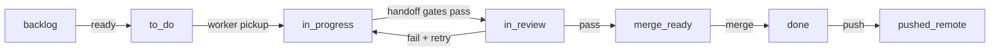
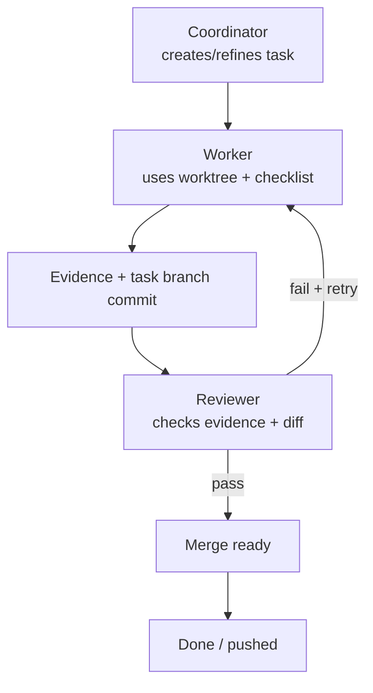

# UTLT Agent Onboarding

This is the 80/20 guide for early-access operators trying `agent@3-alpha` in a
test project. Use a repository or project folder you are comfortable letting
agent workers modify.

Run project commands from the project root unless a step says otherwise.

For the detailed workflow, lane policy, project state layout, and full
worker/reviewer handoff graph, see [onboarding-full.md](onboarding-full.md).

## Index

- [Summary](#summary)
- [Quick Start](#quick-start)
- [Quick Lane Path](#quick-lane-path)
- [Quick Worker/Reviewer Loop](#quick-workerreviewer-loop)
- [Full Guide](#full-guide)

## Summary

Use `agent@3-alpha` when a request should become durable, observable work:
tasks, worker sessions, reviewer sessions, task worktrees, evidence, review,
and merge state. For one-off questions, normal Codex is usually simpler.

The practical loop is:

1. Start from a test project.
2. Initialize ACV3 state.
3. Open the coordinator.
4. Watch tasks and live agents in separate terminals.
5. Let workers edit task worktrees.
6. Let reviewers inspect evidence and committed diffs.
7. Merge only reviewed work.

## Quick Start

Update `utlt`:

```bash
utlt update utlt
```

Update and activate the agent package:

```bash
utlt update agent@3-alpha --install-dependencies
```

Check the active agent:

```bash
utlt agent --version
```

```bash
utlt agent version
```

Move into a test project:

```bash
cd /path/to/test-project
```

Initialize ACV3 state:

```bash
utlt agent init
```

Open the coordinator:

```bash
utlt agent codex
```

Open the task board in a second terminal:

```bash
utlt agent observe tasks
```

Open live worker/reviewer panes in a third terminal:

```bash
utlt agent observe agents
```

Stop all agent sessions when finished:

```bash
utlt agent stop all
```

## Quick Lane Path



## Quick Worker/Reviewer Loop



See [Worker And Reviewer Cycle](onboarding-full.md#worker-and-reviewer-cycle)
for the complete handoff graph.

## Full Guide

Use [onboarding-full.md](onboarding-full.md) when you need:

- the full install and update walkthrough
- the `.arendi/corev3` folder structure
- lane meanings and default lane behavior
- `lanes.toml` policy sections
- the full worker/reviewer handoff graph
- worktree, merge, and troubleshooting details
