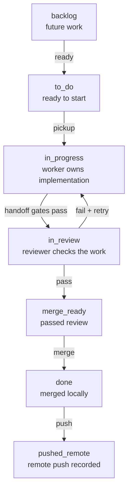
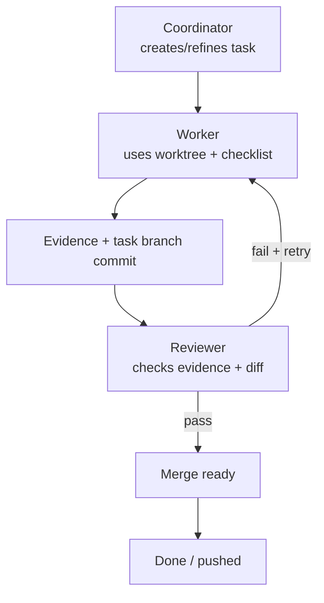

# UTLT Agent Onboarding

This is the 80/20 guide for early-access operators trying `agent@3-alpha` in a
test project. Use a repository or project folder you are comfortable letting
agent workers modify.

Run project commands from the project root unless a step says otherwise.

For the detailed workflow, lane policy, project state layout, and full
worker/reviewer handoff graph, see [onboarding-full.md](onboarding-full.md).

## Index

- [Summary](#summary)
- [Quick Start](#quick-start)
- [Quick Lane Path](#quick-lane-path)
- [Quick Worker/Reviewer Loop](#quick-workerreviewer-loop)
- [Full Guide](#full-guide)

## Summary

Use `agent@3-alpha` when a request should become durable, observable work:
tasks, worker sessions, reviewer sessions, task worktrees, evidence, review,
and merge state. For one-off questions, normal Codex is usually simpler.

The practical loop is:

1. Start from a test project.
2. Initialize ACV3 state.
3. Open the coordinator.
4. Watch tasks and live agents in separate terminals.
5. Let workers edit task worktrees.
6. Let reviewers inspect evidence and committed diffs.
7. Merge only reviewed work.

## Quick Start

Start based on the state of this machine.

Fresh install: if `utlt` is not installed yet, follow the
[root README install guide](../../README.md#install). If you just installed
`utlt` and `agent@3-alpha` from that guide, skip the update commands below and
continue to project setup.

Existing install: refresh the launcher first:

```bash
utlt update utlt
```

Then refresh and activate the agent package:

```bash
utlt update agent@3-alpha --install-dependencies
```

Project setup:

Move into a test project:

```bash
cd /path/to/test-project
```

Initialize ACV3 state for this project:

```bash
utlt agent init
```

This is required before the coordinator, task board, workers, and reviewers can
operate in a project. It creates project-local state under `.arendi/corev3`:

```text
.arendi/corev3/
  lanes.toml
  settings.toml
  tasks/
  events/
  agents/
  sessions/
  worktrees/
  daemon/
  observe/
```

The important part is `worktrees/`. Each task gets its own Git worktree there,
so you can inspect the actual files a worker changed before anything is merged.

Terminal 1 is the coordinator:

```bash
utlt agent codex
```

Use the coordinator as the main UX. Ask it to create/refine tasks, route work,
answer status questions, and merge reviewed work. By default, automation can run
up to five worker tasks in `in_progress` and five reviewer tasks in `in_review`
at the same time. Each task that reaches review gets a reviewer session.

Terminal 2 is the task board:

```bash
utlt agent observe tasks
```

Open this in a separate terminal window or tab. It shows lanes, task details,
checklists, evidence, review status, and merge readiness.

Terminal 3 is the live agent observer:

```bash
utlt agent observe agents
```

Open this in another terminal window or tab. It shows worker and reviewer panes
while they run. Do not type into those panes; ask the coordinator to manage
workers and reviewers.

Before merging, inspect the task worktree and run the project checks there:

```bash
ls .arendi/corev3/worktrees
```

```bash
cd .arendi/corev3/worktrees/t-0001
```

```bash
git status --short
```

Replace `t-0001` with the task worktree you want to QA. The task board shows
which task is ready for review or merge. Merge only after the task has evidence,
a reviewer pass, and worktree checks that match the project.

Stop all agent sessions when finished:

```bash
utlt agent stop all
```

## Quick Lane Path

This is the outer task-board workflow. You see these lanes in
`utlt agent observe tasks`; they describe where one task is in the delivery
process.



## Quick Worker/Reviewer Loop

This is the inner loop for a task after it reaches implementation. The
coordinator routes work, the worker changes the task worktree, and the reviewer
checks the evidence and committed diff before merge.



See [Worker And Reviewer Cycle](onboarding-full.md#worker-and-reviewer-cycle)
for the complete handoff graph.

## Full Guide

Use [onboarding-full.md](onboarding-full.md) when you need:

- the full install and update walkthrough
- the `.arendi/corev3` folder structure
- lane meanings and default lane behavior
- `lanes.toml` policy sections
- the full worker/reviewer handoff graph
- worktree, merge, and troubleshooting details
